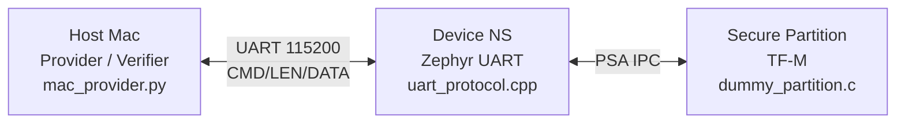
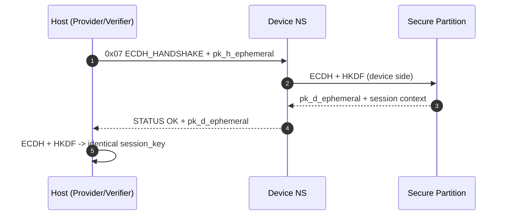
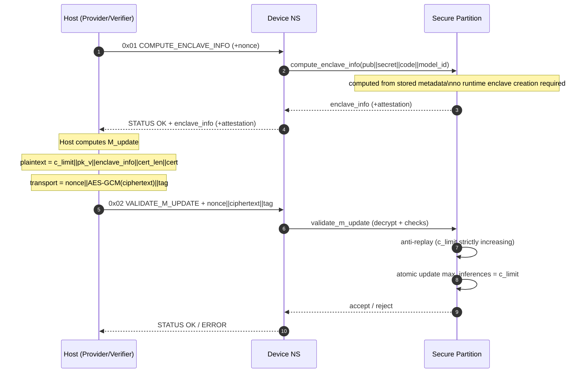
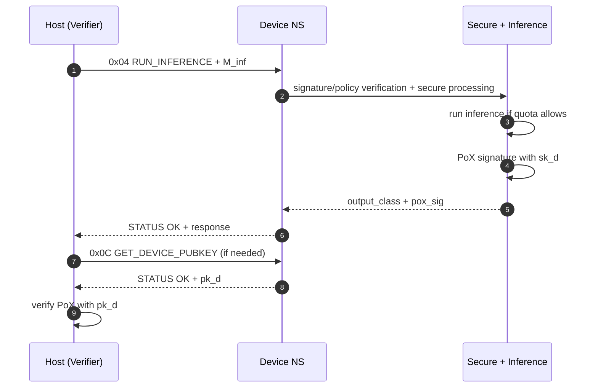
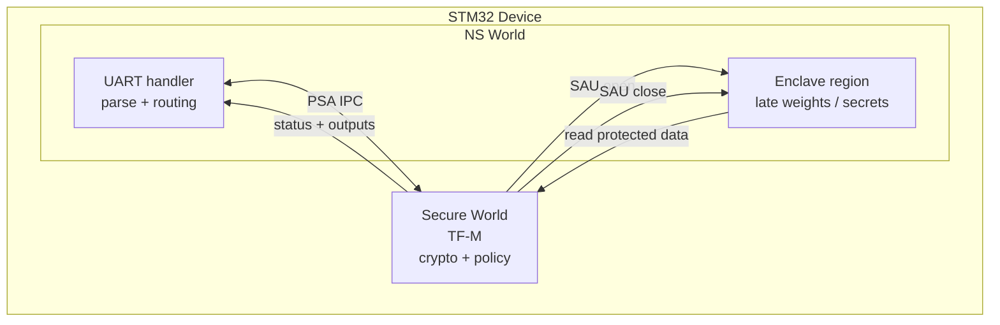
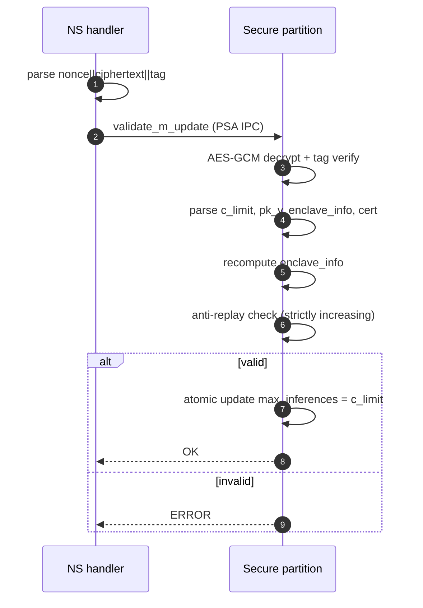
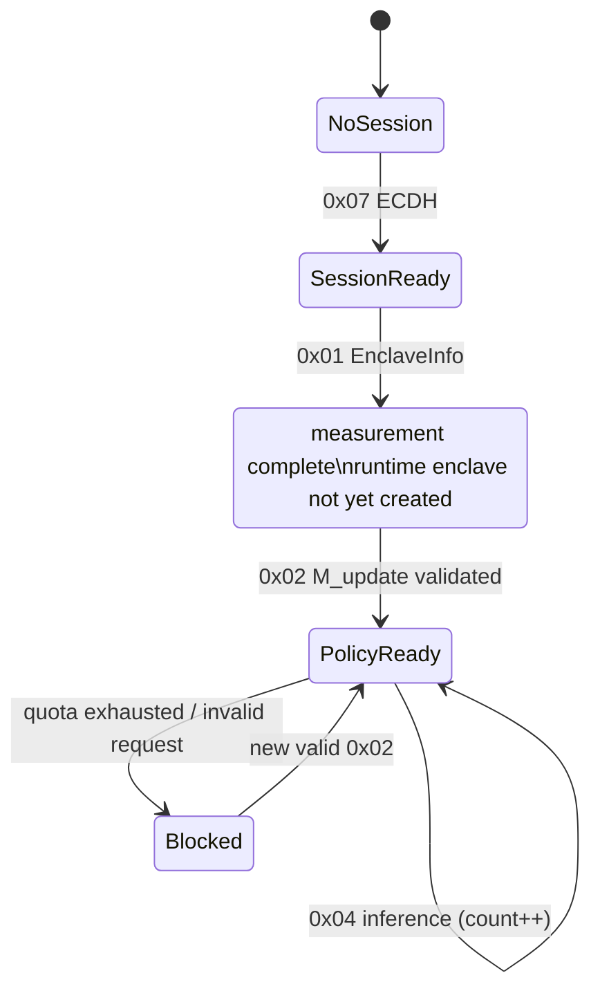
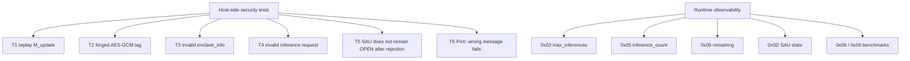

# Global Architecture — clean version (diagrams + detailed exchanges)

## 1) Overview



---

## 2) UART frame (Host ↔ Device)

```text
Host -> Device
+---------+-------------------+-----------+
| CMD (1) | LEN (4, little)   | DATA (n)  |
+---------+-------------------+-----------+

Device -> Host
+------------+-------------------+-----------+
| STATUS (1) | LEN (4, little)   | DATA (n)  |
+------------+-------------------+-----------+

STATUS:
0x00 = OK
0xFF = ERROR
```

---

## 3) Session handshake (ECDH)



---

## 4) Enclave attestation + `M_update`



### Exact `EnclaveInfo` contents

```text
EnclaveInfo (32 bytes) = SHA-256(
    model_pub    (32 bytes) ||
    model_secret (32 bytes) ||
    code_hash    (32 bytes) ||
    model_id     (4 bytes, little-endian)
)
```

```text
Concatenated binary input for the hash:
+----------------------+--------+
| model_pub            | 32 B   |
| model_secret         | 32 B   |
| code_hash            | 32 B   |
| model_id (little)    | 4 B    |
+----------------------+--------+
Total hash input: 100 B
SHA-256 output: 32 B (enclave_info)
```

```text
Important:
- EnclaveInfo is computed even if the runtime enclave has not been created yet.
- The computation uses protected metadata already stored on the device.
- Opening the SAU window for inference execution is not required at this stage.
```

```text
M_update (logical plaintext)
+-------------+----------+------------------+--------------+----------+
| c_limit (4) | pk_v(64) | enclave_info(32) | cert_len (4) | cert (n) |
+-------------+----------+------------------+--------------+----------+

M_update (transport)
+------------+----------------+----------+
| nonce (12) | ciphertext (n) | tag (16) |
+------------+----------------+----------+
```

---

## 5) Verified inference + PoX



```text
M_inf (active format)
+------------+--------------+-----------------+
| nonce (12) | model_id (4) | signature_v (64)|
+------------+--------------+-----------------+

Secure inference response
+-----------------+-------------+
| output_class (1)| pox_sig (64)|
+-----------------+-------------+

Logical PoX-signed message
+----------+---------+------------+---------------+
| model_id | cert(n) | nonce_inf  | output_class  |
+----------+---------+------------+---------------+
```

---

## 6) Internal device focus (NS ↔ Secure ↔ Enclave)



```text
Execution rule:
Host CMD -> NS handler -> PSA IPC -> Secure validation/crypto ->
if authorized: Secure opens SAU, reads enclave data, computes, closes SAU ->
status/result returned to NS -> Host
```

---

## 7) Internal `0x04` pipeline (inference)


---

## 8) Internal `0x02` pipeline (`M_update`)



---

## 9) State machine



---

## 10) Security + observability


