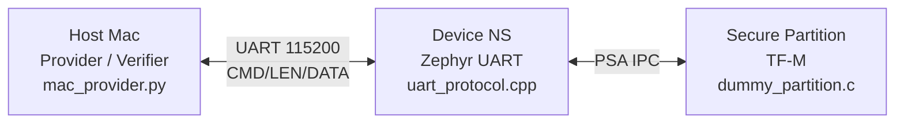
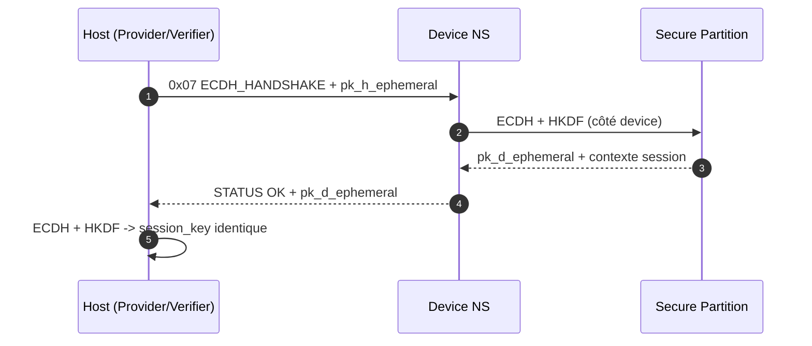
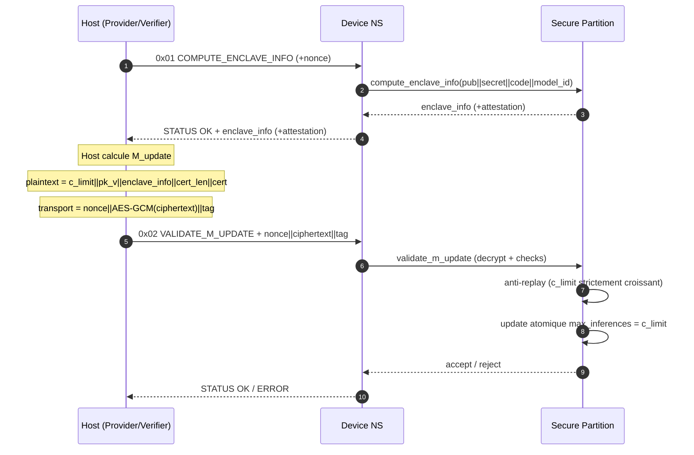
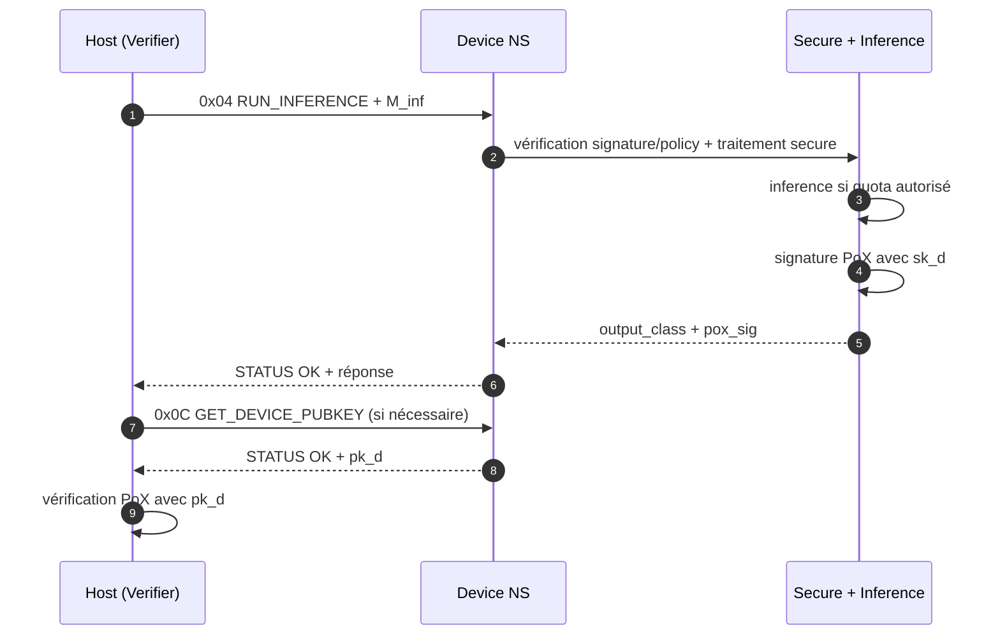
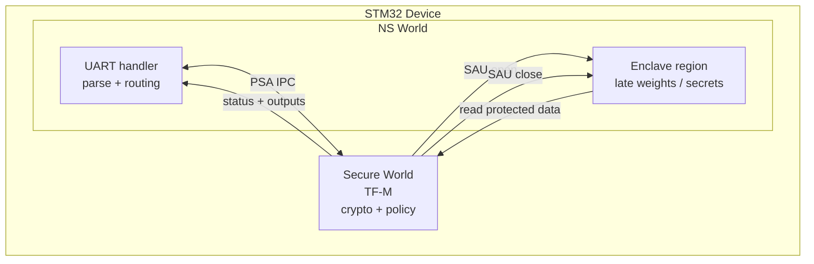
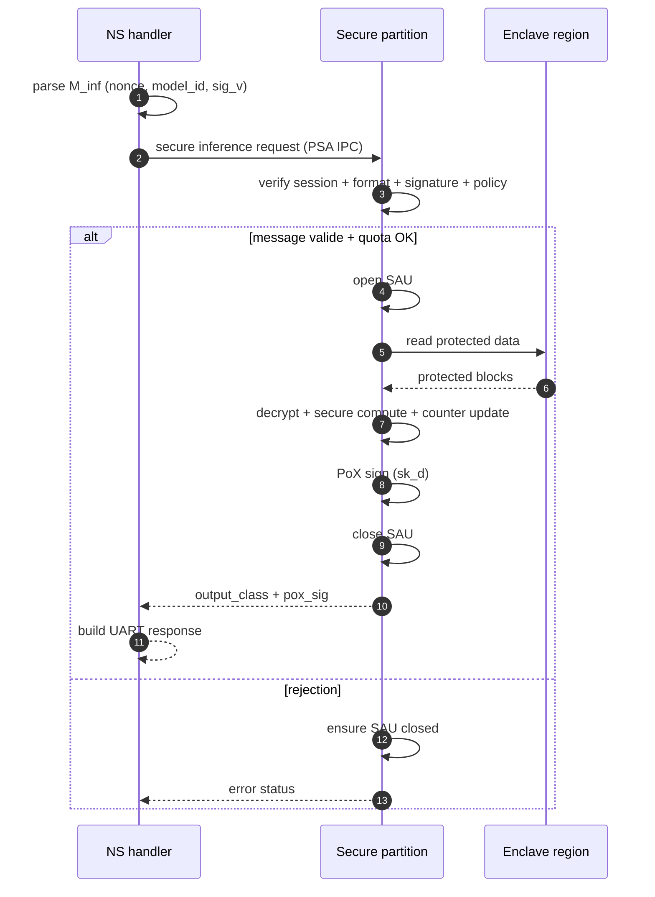
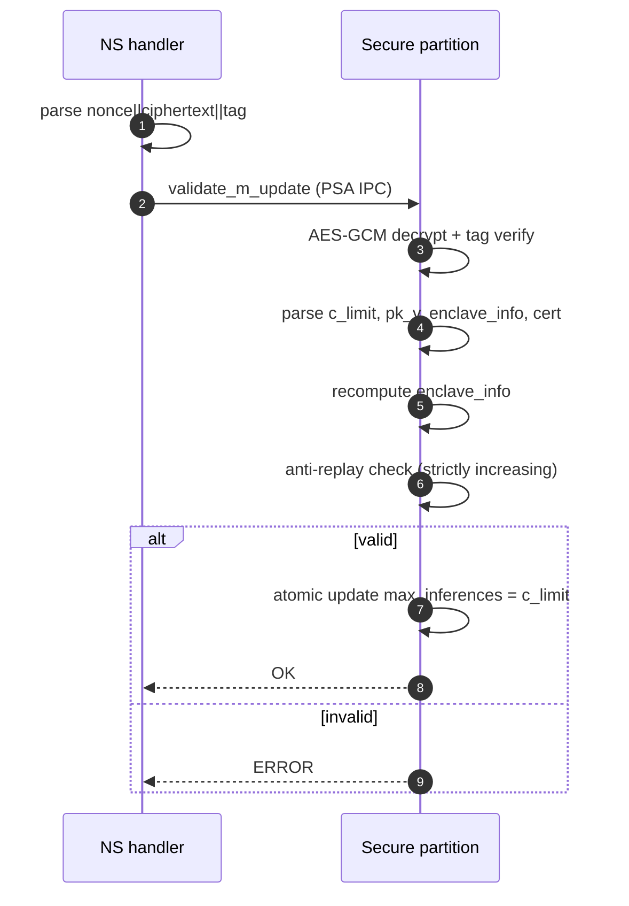
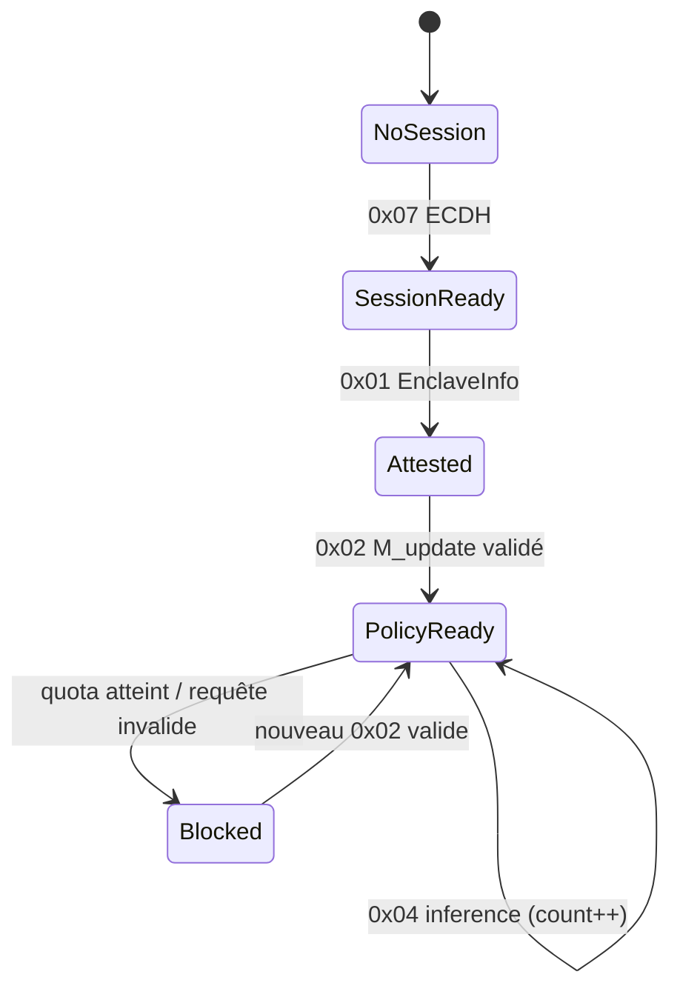
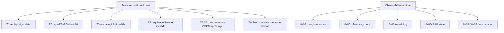

# Architecture globale — version propre (dessins + échanges détaillés)

## 1) Vue d’ensemble



---

## 2) Trame UART (Host ↔ Device)

```text
Host -> Device
+---------+-------------------+-----------+
| CMD (1) | LEN (4, little)   | DATA (n)  |
+---------+-------------------+-----------+

Device -> Host
+------------+-------------------+-----------+
| STATUS (1) | LEN (4, little)   | DATA (n)  |
+------------+-------------------+-----------+

STATUS:
0x00 = OK
0xFF = ERROR
```

---

## 3) Handshake de session (ECDH)



---

## 4) Attestation enclave + `M_update`



```text
M_update (plaintext logique)
+-------------+----------+------------------+--------------+----------+
| c_limit (4) | pk_v(64) | enclave_info(32) | cert_len (4) | cert (n) |
+-------------+----------+------------------+--------------+----------+

M_update (transport)
+------------+----------------+----------+
| nonce (12) | ciphertext (n) | tag (16) |
+------------+----------------+----------+
```

---

## 5) Inférence vérifiée + PoX



```text
M_inf (format actif)
+------------+--------------+-----------------+
| nonce (12) | model_id (4) | signature_v (64)|
+------------+--------------+-----------------+

Réponse inférence sécurisée
+-----------------+-------------+
| output_class (1)| pox_sig (64)|
+-----------------+-------------+

Message logique signé PoX
+----------+---------+------------+---------------+
| model_id | cert(n) | nonce_inf  | output_class  |
+----------+---------+------------+---------------+
```

---

## 6) Focus interne device (NS ↔ Secure ↔ Enclave)



```text
Règle d’exécution:
Host CMD -> NS handler -> PSA IPC -> Secure validation/crypto ->
si autorisé: Secure ouvre SAU, lit l'enclave, calcule, referme SAU ->
retour status/résultat vers NS -> Host
```

---

## 7) Pipeline interne `0x04` (inférence)



---

## 8) Pipeline interne `0x02` (`M_update`)



---

## 9) Machine d’états



---

## 10) Sécurité + observabilité


