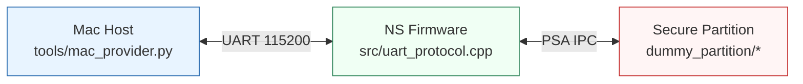
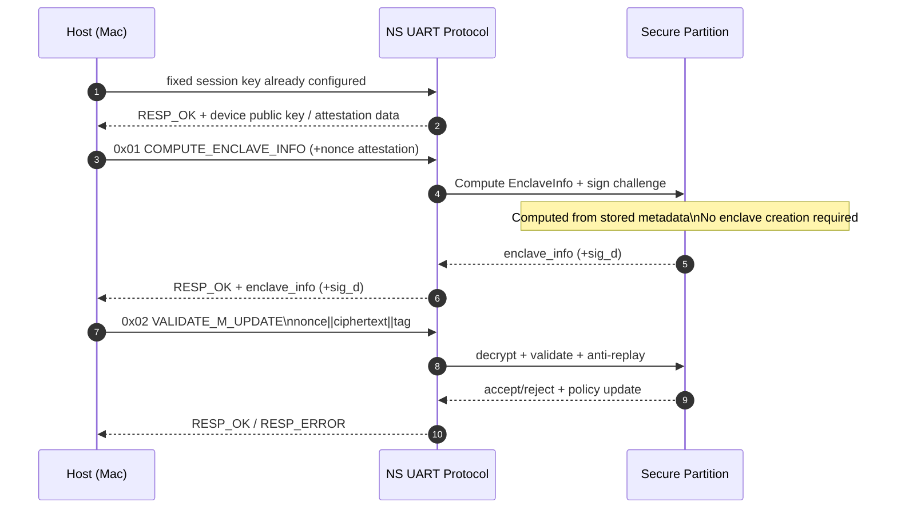
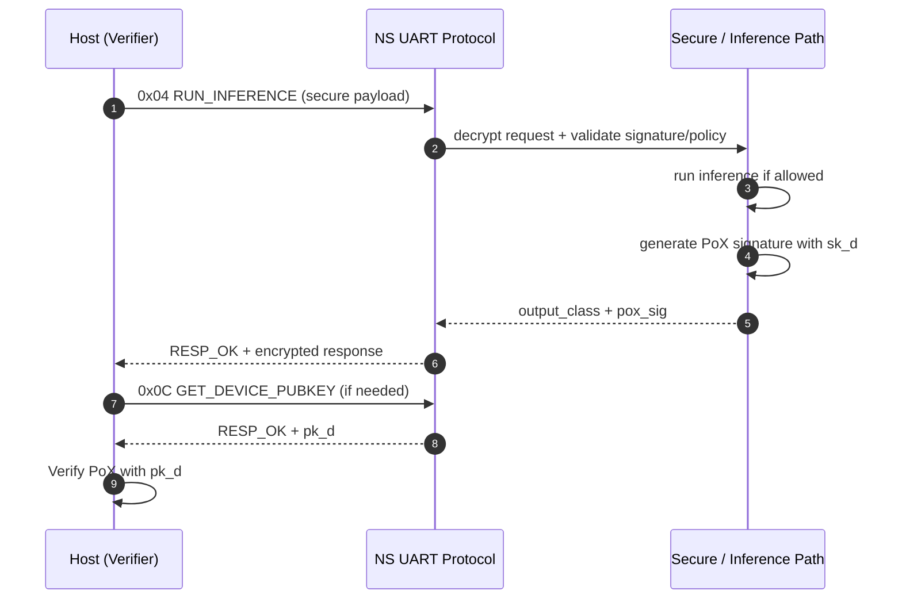
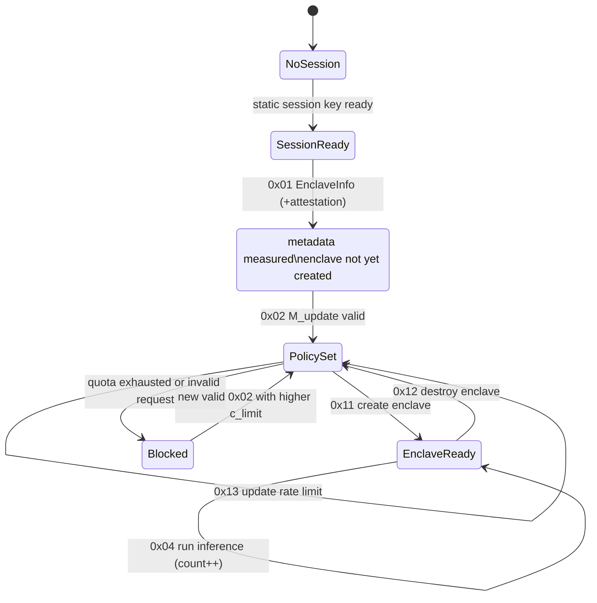
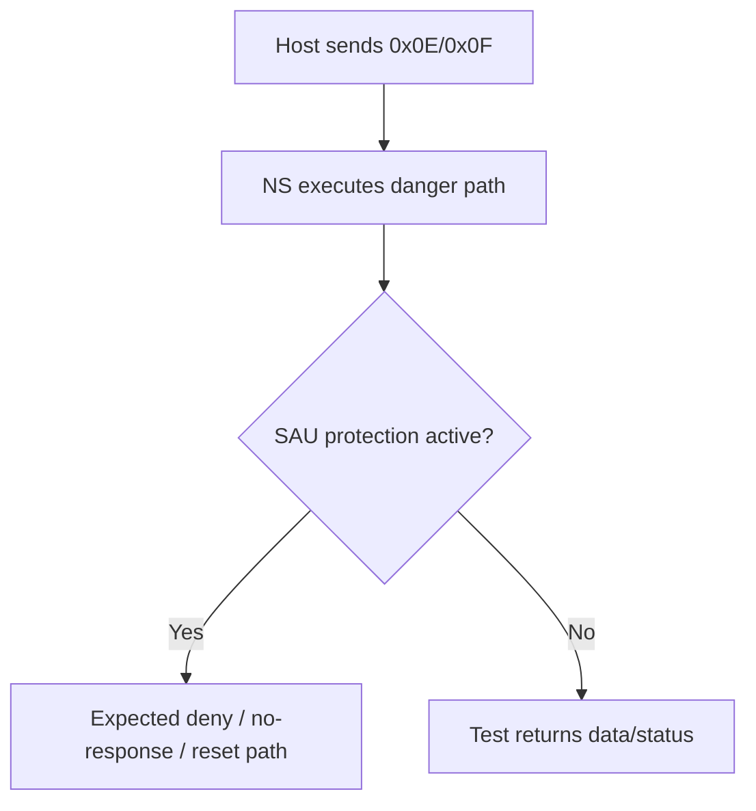

# Protocol Detailed Architecture (Mac ↔ STM32 ↔ Secure Partition)

This document describes the end-to-end protocol between the host (Mac), the Non-Secure firmware (Zephyr), and the Secure partition (TF-M).

---

## 1) Overview



### Roles
- **Mac**: Provider/Verifier, builds messages (`M_update`, `M_inf`), verifies PoX.
- **NS**: UART parser, command routing, inference orchestration.
- **Secure**: sensitive validation, policy management, and memory protection (SAU/TrustZone).

---

## 2) Binary packet format

### Request (Host → Device)

```text
+---------+-------------------+-----------+
| CMD (1) | LEN (4, little)   | DATA (n)  |
+---------+-------------------+-----------+
```

### Response (Device → Host)

```text
+------------+-------------------+-----------+
| STATUS (1) | LEN (4, little)   | DATA (n)  |
+------------+-------------------+-----------+
```

### Status codes
- `0x00` = `RESP_OK`
- `0xFF` = `RESP_ERROR`

---

## 3) Command map (`0x01..0x13`)

| CMD | Name | Purpose |
|---|---|---|
| `0x01` | `CMD_COMPUTE_ENCLAVE_INFO` | EnclaveInfo computation (optional attestation) |
| `0x02` | `CMD_VALIDATE_M_UPDATE` | Apply quota after AES-GCM decryption |
| `0x03` | `CMD_GET_MAX_INFERENCES` | Read max quota |
| `0x04` | `CMD_RUN_INFERENCE` | Inference execution (legacy or secure path) |
| `0x05` | `CMD_GET_INFERENCE_COUNT` | Read consumed quota |
| `0x06` | `CMD_GET_REMAINING_INFERENCES` | Read remaining quota |
| `0x07` | removed | Static AES-GCM session key is used instead |
| `0x08` | `CMD_GET_BENCHMARK` | NS benchmark |
| `0x09` | `CMD_GET_SECURE_BENCHMARK` | Secure benchmark |
| `0x0A` | `CMD_GET_INFERENCE_RESULT` | Last result |
| `0x0B` | `CMD_SET_MAX_INFERENCES` | Quota override (test only) |
| `0x0C` | `CMD_GET_DEVICE_PUBKEY` | Export `pk_d` (host PoX verification) |
| `0x0D` | `CMD_GET_SAU_STATE` | SAU state (`state/base/size`), best-effort on hardened policy |
| `0x0E` | `CMD_RUN_INFERENCE_NO_SAU` | Danger test: inference without explicit create |
| `0x0F` | `CMD_READ_PROTECTED_MEM` | Danger test: direct protected memory read |
| `0x11` | `CMD_CREATE_ENCLAVE` | Explicit enclave create lifecycle command |
| `0x12` | `CMD_DESTROY_ENCLAVE` | Explicit enclave destroy lifecycle command |
| `0x13` | `CMD_UPDATE_RATE_LIMIT` | Update quota via secure API (`uint32 LE`) |

---

## 4) Exchange architecture (sequences)

## 4.1 Handshake + Attestation + Policy



### `M_update` (logical plaintext)

```text
c_limit (4) || pk_v (64) || enclave_info (32) || cert_len (4) || cert (n)
```

### Properties
- Anti-replay: `c_limit` must **strictly increase**.
- Integrity/authentication: AES-GCM tag.
- Dynamic policy: `max_inferences` comes from validated `c_limit`.
- `EnclaveInfo` is computed before runtime enclave creation; it hashes device-side metadata (`pub || secret || code || model_id`) and does not require the enclave execution window to be open.

---

## 4.2 Verified inference (`M_inf` + PoX)



### `M_inf` (active format)

```text
nonce_inf || model_id || signature_v
```

### Secure inference response

```text
output_class (1) || pox_sig (64)
```

### Signed PoX message (logical)

```text
model_id || cert || nonce_inf || output_class
```

---

## 5) Simplified state machine



---

## 6) Security flow (negative tests)

Tests are triggered from the host side through `tools/mac_provider.py` (security menu):

- **T1** `M_update` replay → expected rejection.
- **T2** tampered AES-GCM tag → expected rejection.
- **T3** invalid `EnclaveInfo` → expected rejection.
- **T4** invalid inference request/signature → expected rejection.
- **T5** rejection must not force SAU open as a side effect.
- **T6** negative PoX verification: wrong message fails, correct message succeeds.

---

## 7) Danger tests (`0x0E`, `0x0F`)



These commands are for memory/protection robustness validation, not the nominal flow.

---

## 8) Observability / diagnostics

Useful commands:
- `0x03/0x05/0x06` to track max/consumed/remaining quota.
- `0x0D` to inspect SAU state (`UNREGISTERED/OPEN/CLOSED` + base + size).
- `0x08/0x09` to compare NS vs Secure cost.

---

## 9) Exchange architecture summary

1. **Session** (`0x07`)  
2. **Enclave attestation** (`0x01`)  
3. **Policy provisioning** through encrypted `M_update` (`0x02`)  
4. **Verified inference** (`0x04`) + **PoX**  
5. **Host-side verification** with `pk_d` (`0x0C`)  
6. **Audit** through quota/benchmark/SAU (`0x03..0x0D`)  
7. **Robustness checks** through danger tests (`0x0E`, `0x0F`)  

---

## 10) References in this repository

- `src/uart_protocol.h`
- `src/uart_protocol.cpp`
- `src/inference_protocol.h`
- `src/inference_protocol.cpp`
- `tools/mac_provider.py`
- `md/UART_PROTOCOL_SPEC.md`
- `md/INFERENCE_PROTOCOL_IMPL.md`
- `md/VERIFICATION_REPORT.md`
