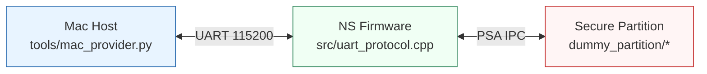
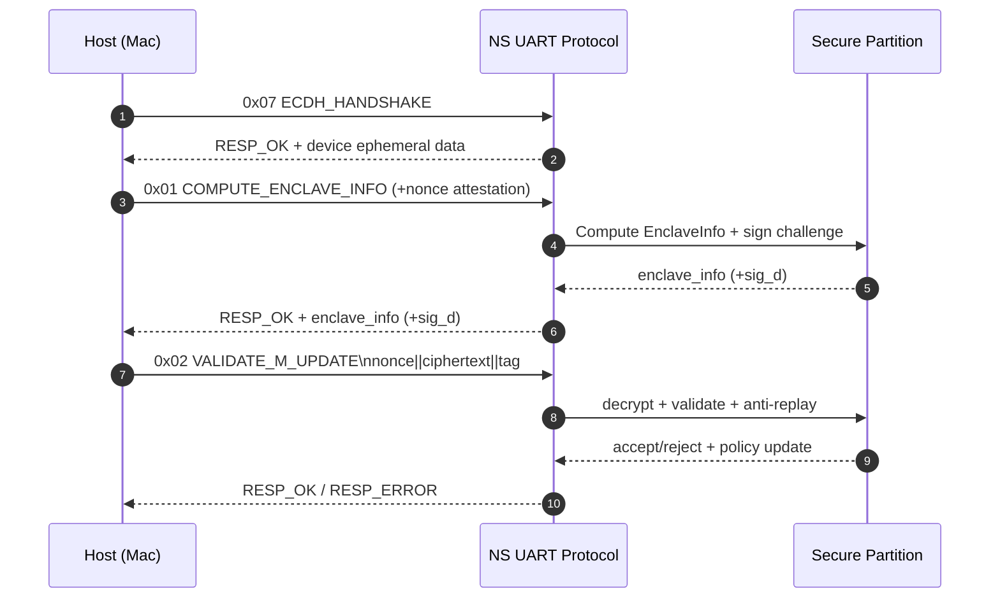
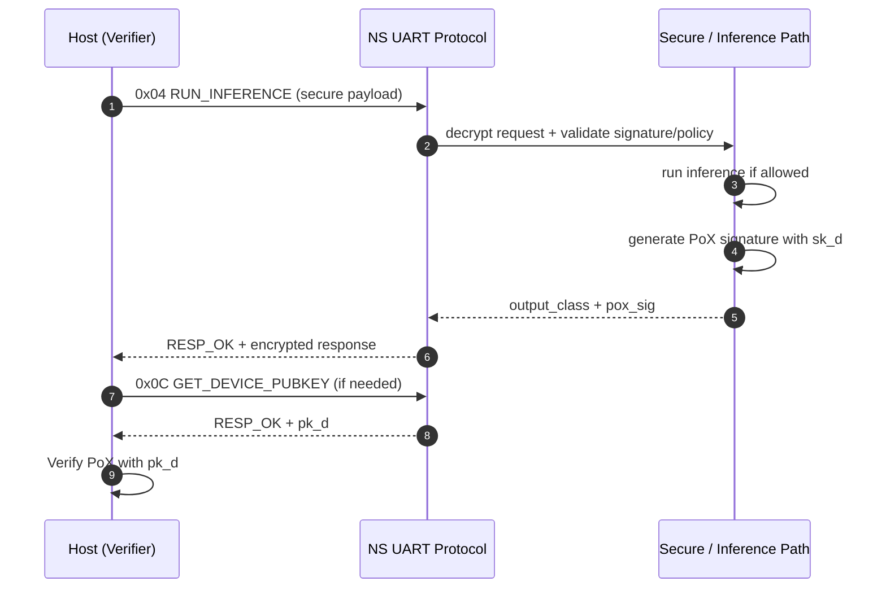
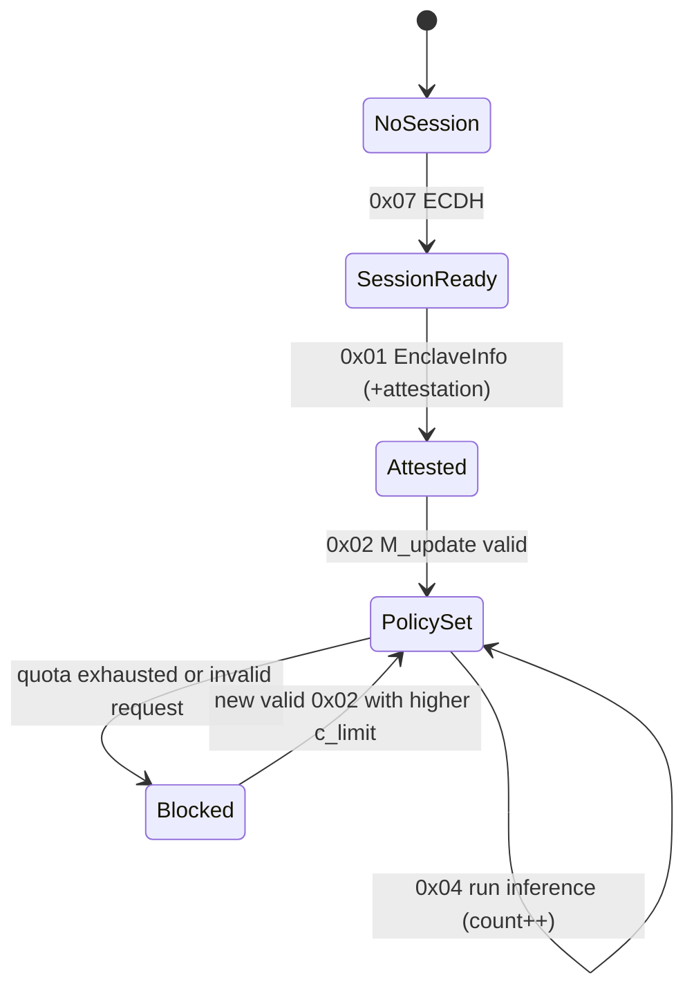
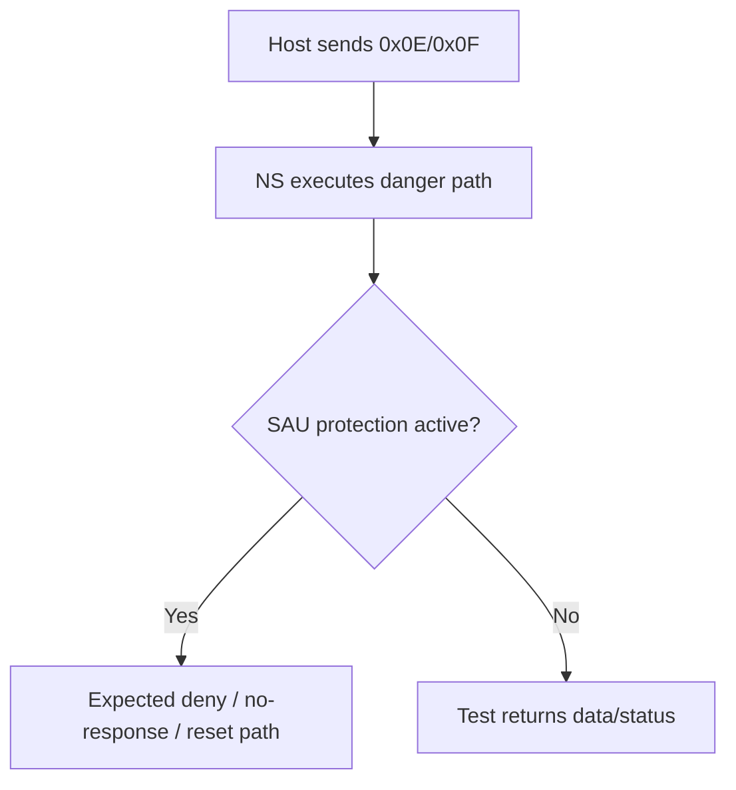

# Protocol Detailed Architecture (Mac ↔ STM32 ↔ Secure Partition)

Ce document décrit en détail le protocole d’échange entre le host (Mac), le firmware Non-Secure (Zephyr), et la partition Secure (TF-M).

---

## 1) Vue d’ensemble



### Rôles
- **Mac**: Provider/Verifier, construit les messages (`M_update`, `M_inf`), vérifie PoX.
- **NS**: parser UART, routage des commandes, orchestration inference.
- **Secure**: validations sensibles, gestion de politique et protection mémoire (SAU/TrustZone).

---

## 2) Format binaire des paquets

### Requête (Host → Device)

```text
+---------+-------------------+-----------+
| CMD (1) | LEN (4, little)   | DATA (n)  |
+---------+-------------------+-----------+
```

### Réponse (Device → Host)

```text
+------------+-------------------+-----------+
| STATUS (1) | LEN (4, little)   | DATA (n)  |
+------------+-------------------+-----------+
```

### Status codes
- `0x00` = `RESP_OK`
- `0xFF` = `RESP_ERROR`

---

## 3) Carte des commandes (`0x01..0x0F`)

| CMD | Nom | Objet |
|---|---|---|
| `0x01` | `CMD_COMPUTE_ENCLAVE_INFO` | EnclaveInfo (option attestation) |
| `0x02` | `CMD_VALIDATE_M_UPDATE` | Appliquer quota après déchiffrement AES-GCM |
| `0x03` | `CMD_GET_MAX_INFERENCES` | Lire quota max |
| `0x04` | `CMD_RUN_INFERENCE` | Inference (legacy ou secure path) |
| `0x05` | `CMD_GET_INFERENCE_COUNT` | Lire quota consommé |
| `0x06` | `CMD_GET_REMAINING_INFERENCES` | Lire quota restant |
| `0x07` | `CMD_ECDH_HANDSHAKE` | Initialiser contexte de session |
| `0x08` | `CMD_GET_BENCHMARK` | Bench NS |
| `0x09` | `CMD_GET_SECURE_BENCHMARK` | Bench Secure |
| `0x0A` | `CMD_GET_INFERENCE_RESULT` | Dernier résultat |
| `0x0B` | `CMD_SET_MAX_INFERENCES` | Override quota (test) |
| `0x0C` | `CMD_GET_DEVICE_PUBKEY` | Export `pk_d` (vérif PoX côté host) |
| `0x0D` | `CMD_GET_SAU_STATE` | État SAU (`state/base/size`) |
| `0x0E` | `CMD_RUN_INFERENCE_NO_SAU` | Test danger: inference sans SAU open |
| `0x0F` | `CMD_READ_PROTECTED_MEM` | Test danger: lecture mémoire protégée |

---

## 4) Architecture d’échange (séquences)

## 4.1 Handshake + Attestation + Policy



### `M_update` (plaintext logique)

```text
c_limit (4) || pk_v (64) || enclave_info (32) || cert_len (4) || cert (n)
```

### Propriétés
- Anti-replay: `c_limit` doit **strictement augmenter**.
- Intégrité/authentification: AES-GCM tag.
- Policy dynamique: `max_inferences` vient de `c_limit` validé.

---

## 4.2 Inference vérifiée (`M_inf` + PoX)



### `M_inf` (forme utilisée)

```text
nonce_inf || model_id || signature_v
```

### Réponse secure inference

```text
output_class (1) || pox_sig (64)
```

### Message PoX signé (logique)

```text
model_id || cert || nonce_inf || output_class
```

---

## 5) Machine d’états simplifiée



---

## 6) Flux de sécurité (tests négatifs)

Les tests sont pilotés côté host via `tools/mac_provider.py` (menu sécurité):

- **T1** replay `M_update` → rejet attendu.
- **T2** tag AES-GCM altéré → rejet attendu.
- **T3** `EnclaveInfo` invalide → rejet attendu.
- **T4** requête inference/signature invalide → rejet attendu.
- **T5** un rejet ne doit pas ouvrir la SAU par effet de bord.
- **T6** PoX négatif: mauvais message = échec, bon message = succès.

---

## 7) Tests danger (`0x0E`, `0x0F`)



Ces commandes servent à valider la robustesse mémoire/protection, pas le chemin nominal.

---

## 8) Observabilité / diagnostics

Commandes utiles:
- `0x03/0x05/0x06` pour suivre quota max/consommé/restant.
- `0x0D` pour vérifier état SAU (`UNREGISTERED/OPEN/CLOSED` + base + size).
- `0x08/0x09` pour comparer coûts NS vs Secure.

---

## 9) Résumé de l’architecture d’échange

1. **Session** (`0x07`)  
2. **Attestation enclave** (`0x01`)  
3. **Policy provisioning** via `M_update` chiffré (`0x02`)  
4. **Inference vérifiée** (`0x04`) + **PoX**  
5. **Vérification host** avec `pk_d` (`0x0C`)  
6. **Audit** via quota/bench/SAU (`0x03..0x0D`)  
7. **Robustesse** via tests danger (`0x0E`, `0x0F`)  

---

## 10) Références dans le repo

- `src/uart_protocol.h`
- `src/uart_protocol.cpp`
- `src/inference_protocol.h`
- `src/inference_protocol.cpp`
- `tools/mac_provider.py`
- `md/UART_PROTOCOL_SPEC.md`
- `md/INFERENCE_PROTOCOL_IMPL.md`
- `md/VERIFICATION_REPORT.md`
