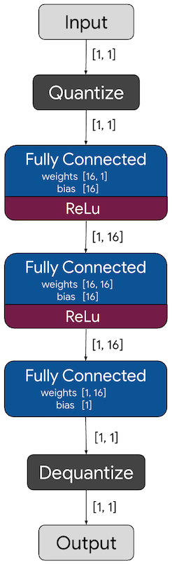

# Model Training & Artifact Generation

## Overview
Scripts here train and export the CIFAR-10 model and generate artifacts used by the firmware. The current **split inference** flow uses weights exported from SecureQNN logs, but the training scripts remain useful for regenerating the full model or experimenting with variants.

## Python Environment
```bash
python3.12 -m venv .venv
source .venv/bin/activate  # macOS/Linux
pip install tensorflow==2.20.0 numpy
```

## Main Scripts

### train_lite_resnet.py
Trains a lightweight CIFAR-10 ResNet and exports:
- `../src/cifar_resnet_lite_int8.tflite`
- `../src/cifar_resnet_lite_int8_data.cc`
- `../src/cifar_resnet_lite_int8_data.h`

### encrypt_model.py (legacy)
Encrypts the **full** model (legacy) and generates:
- `../src/cifar_resnet_lite_int8_encrypted.h`

> The current split flow does **not** use this path. Late weights are encrypted via AES-CTR and generated under `split_inference/late/`.

## Typical Workflow (Legacy Full-Model)
```bash
python train_lite_resnet.py
python encrypt_model.py
```

## Notes
- TensorFlow requires Python 3.12 in this setup.
- For split inference artifacts, see [tools/README.md](../tools/README.md) and [split_inference/README.md](../split_inference/README.md).


## Trained Models

Download Link | [hello_world.zip](https://storage.googleapis.com/download.tensorflow.org/models/tflite/micro/hello_world_2020_12_28.zip)
------------- | ------------------------------------------------------------------------------------------------------------------------

The `models` directory in the above zip file can be generated by following the
instructions in the [Training](#training) section above. It
includes the following 3 model files:

| Name | Format | Target Framework | Target Device |
| :------------- |:-------------|:-------------|-----|
| `model.pb` | Keras SavedModel | TensorFlow | Large-Scale/Cloud/Servers   |
| `model.tflite` *(2.5 kB)*  | Integer Only Quantized TFLite Model | TensorFlow Lite | Mobile Devices|
| `model.cc`  | C Source File | TensorFlow Lite for Microcontrollers | Microcontrollers |


## Model Architecture

The final model used to simulate a sine wave is displayed below. It is a
simple feed forward deep neural network with 2 fully connected layers with
ReLu activations and a final fully connected output layer with as shown below.



*This image was derived from visualizing the 'model.tflite' file in [Netron](https://github.com/lutzroeder/netron)*

